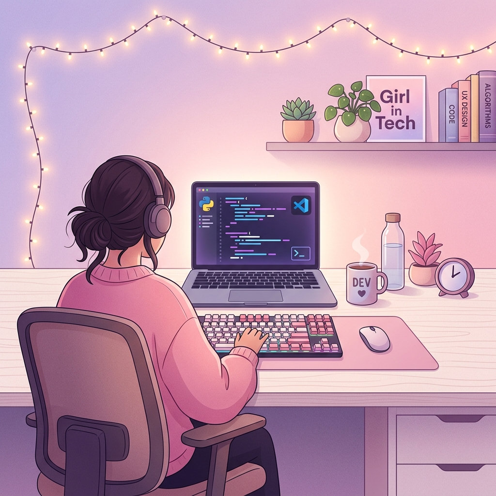

# ✨ Hi, I'm Khanza Haura! 🎀
### 💻 IT Girl in Tech | Full-Stack Developer🌸

  

  
  
  
  

---

### 💫 About Me

> *Just a girl who codes elegant solutions, designs aesthetic interfaces, and loves building functional web applications! ☕✨*

- 🔭 **Current Focus**: Designing and developing aesthetic, user-centric web applications using React and Node.js.
- 🌱 **Currently Learning**: Advanced frontend frameworks (like Next.js), interactive UI animations, and design prototyping in Figma.
- 👯 **Open to Collaborate**: Creative frontend challenges, open-source projects, and UI design systems.
- ⚡ **Fun Fact**: I believe clean code is just as important as a beautiful user interface! 🌸✨

---

### 🛠️ My Tech Stack

  <!-- Frontend -->
  
  
  

  <!-- Backend & Tools -->
  
  

---

  <i>"She believed she could, so she coded." 🌸✨</i>

